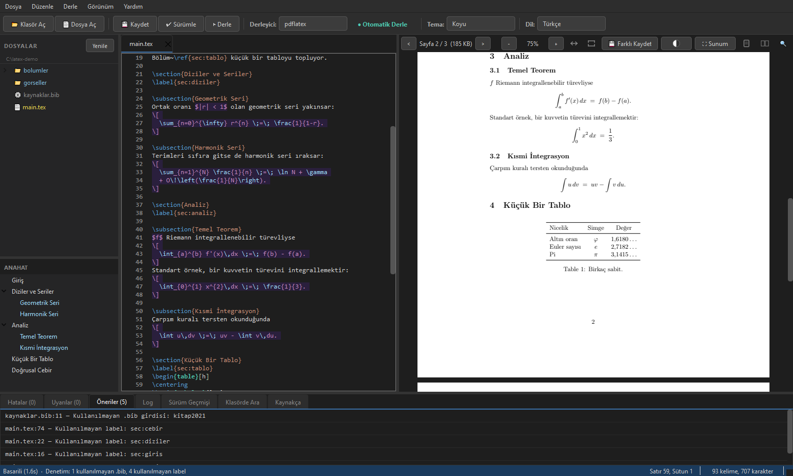
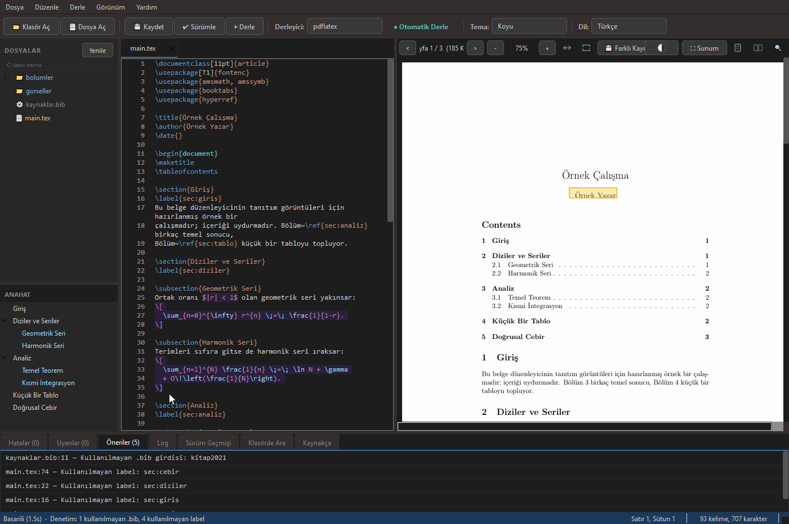

# LaTeX Editor

[](https://github.com/s-balli/latex-editor/actions)
[](LICENSE)
[](https://github.com/s-balli/latex-editor/releases)
[](https://github.com/s-balli/latex-editor/releases)

> 🌐 **Tanıtım sayfası:** https://s-balli.github.io/latex-editor/

> **English:** [README.md](README.md) | **Türkçe:** README.tr.md (şu an buradasınız)

PyQt6 tabanlı LaTeX editörü ve derleyici. Notepad++ tarzı düzenlemeyi gömülü PDF önizleme, sözdizimi renklendirme, SyncTeX, çoklu tema ve dil desteği ile birleştirir. Windows (TeX Live için WSL) ve Linux (AppImage). GPL-3.0 lisanslı. Pasif/deneysel bir web sürümü (FastAPI + React/Monaco) `web/` altında bulunur ancak **dağıtılmaz**.

---

 ## Ekran görüntüsü



### SyncTeX canlı

Editörde bir satıra Ctrl+Click → PDF o konuma, sayfalar arası bile zıplar. PDF'e Ctrl+Click → editör o kaynak satıra geri döner.



---

## İndirme / Download

| Platform | Dosya | Gereksinim |
|----------|-------|------------|
| **Windows** | `LaTeX_Editor_v*_Windows.exe` (portable) | [WSL](https://learn.microsoft.com/en-us/windows/wsl/install) + TeX Live |
| **Linux** | `LaTeX_Editor_v*_Linux_x86_64.AppImage` | TeX Live |

➜ **[Download (Releases) sayfası](https://github.com/s-balli/latex-editor/releases)**

> ⚠️ **Önemli:** Uygulama yalnızca GUI'yi içerir. LaTeX derleyicisi (`lualatex`/`pdflatex`/`xelatex`) ayrıca **TeX Live** ile kurulmalıdır — Windows'ta **WSL** üzerinden, Linux'ta `apt` ile. Detaylar için [Gereksinimler](#gereksinimler) bölümüne bakın.

---

## Sürüm Geçmişi

### v1.0.20: LaTeX'i Bilen Yazım Denetimi ve Açılmayan İki Yapı
- **İstendiğinde yazım denetimi**: panelde Yazım sekmesi, dil seçici ve Denetle düğmesi. Türkçe ve İngilizce sözlükler uygulamanın içinde geliyor, hiçbir şey indirilmiyor ve ayrıca kurulması gereken bir şey yok. Siz istemeden devreye girmiyor: sözlük yüklenmiyor, ekranda kendiliğinden hiçbir şey değişmiyor, denetim ancak düğmeye basınca koşuyor. Sözlük ayrı bir iş parçacığında yükleniyor, o sırada arayüz donmuyor
- **LaTeX'i biliyor**, zor kısım da tam olarak bu: düz bir denetleyici `\usepackage`, `\alpha`, `sec:giris` ve `ornek2024` hepsinin altını çizer ve araç kullanılamaz hale gelir. Önsöz denetlenmiyor, aksan makroları ürettikleri harf olarak okunuyor, `\section` ve `\caption` argümanları düz metin sayılırken `\label` ve `\cite` sayılmıyor, e-posta adresleri, bağlantılar, DOI'ler, tablo sütun belirteçleri ve kaynakça etiketleri dışarıda kalıyor. Yalnızca önsözü atlamak bir ders notu setinde 2533 bulguyu 1679'a indirdi; aksan işlemesi başka bir şablonda işaretlenen oranı yüzde 9.9'dan 4.8'e düşürdü
- **İki dilli belgeler için ikinci sözlük**: Türkçe bir tezin İngilizce özeti, ya da tersi, baştan sona yanlış işaretleniyordu. "Bu belgede ikinci dil de var" kutusunu işaretleyince o bölümler de düzgün denetleniyor. İkinci sözlük bir kelimeyi ancak kendi diline ait görünüyorsa kurtarabiliyor, çünkü ters yön zararlı: Türkçe sözlük saf ASCII Latince kelimeleri kabul ediyor ve İngilizce bir belgede gerçek gürültüyü gizliyordu. Gerçek bir bildiride 424 bulgu 122'ye, bir ders notu bölümünde 214 bulgu 79'a indi
- **Kendi sözlüğünüz**: bir kelimeye sağ tıklayıp öneri alabiliyor ya da sözlüğe ekleyebiliyorsunuz, eklenen kelimeler sonraki açılışlarda da duruyor. Öneriler önden değil istendiğinde hesaplanıyor, çünkü tek bir kelime bir saniyeye kadar sürüyor ve listenin tamamı paneli kilitlerdi
- **Windows yapısı hiç açılmayacaktı**: güncelleme diyaloğunun ihtiyaç duyduğu bir modül paketleme hariç tutma listesindeydi, bu yüzden exe başlayıp günlüğe tek satır yazmadan hemen düşüyordu. Yayınlanmış v1.0.19 bundan etkilenmiyor; kusur tag atıldıktan sonra geldi. Aynı sınıf hata daha önce de bir kez yaşanmıştı, o yüzden hariç tutma listeleri artık pakete giren kodun gerçekten neyi import ettiğine karşı, iki platformda birden denetleniyor
- **Linux AppImage temiz bir sistemde açılmıyordu**: yapım ortamında dört X11 kütüphanesi eksikti ve PyInstaller bulamadığını sessizce atlıyor. O paketler kurulu olmayan temiz bir Ubuntu 24.04'te v1.0.19 çekirdek dökümüyle çıkıyor; bu yapı çalışıyor. Qt platform eklentisinin bağımlılıklarından biri bile çözülemezse yayın artık duruyor
- **XeTeX ile `\usepackage[T1]{fontenc}` birlikte Türkçe harfleri sessizce düşürüyor**: derleme başarılı bitiyor, PDF açılıyor, Türkçeye özgü dört harf orada olmuyor. Tek belgede ölçüldü: pdflatex ile 92 harf, bu birleşimle 37, satır kaldırılınca yine 92. Günlük `Missing character` diyor ve onu okuyan yoktu. Uyarı artık panele ulaşıyor, günlüğün taşıyabildiği binlerce satır yerine yazı tipi başına tek satır olarak, uygulanacak düzeltmeyle birlikte
- **Okunamayan metinler**: Hakkında, Özellikler ve Ortam Denetimi pencereleri koyu temalarda beyaz zeminde kalıyordu, güncelleme diyaloğundaki Releases bağlantısı yedi temanın beşinde neredeyse görünmüyordu, sekme üzerine gelme dördünde okunmuyordu, soluk metin ve klasör yolu etiketi ise yedisinde birden eşiğin altındaydı. Hepsi kaynak koda değil çalışan uygulamaya bakılarak WCAG AA eşiğine karşı ölçüldü ve artık bir test yedi temayı birden tarıyor, yani bu sınıf geri gelemiyor
- **Güncelleme diyaloğu sürüm notlarının yüzde 14'ünü gösteriyordu**: satır sonları çöktüğü için on üç madde tek paragrafa yapışıyordu, markdown başlığı ham görünüyordu ve metin cümlenin ortasında 500 karakterde kesiliyordu, devamı olduğunu söyleyen bir işaret de yoktu
- **Büyük harfli `.TEX` uzantısı görmezden geliniyordu**: böyle adlandırılmış bir kök dosya dosya ağacında derlenemez sayılıyordu ve açıldığında motor algılama hiç koşmuyordu, yani bir önceki belgenin motoruyla derlenebiliyordu
- **WSL eksikken ortam denetimi** artık sonraki adımı da söylüyor, çünkü taze kurulan bir WSL'de hiç TeX bulunmuyor. "WSL kurulu değil" ile "WSL kurulu ama dağıtım yok" durumları da ayrıldı; ikisi de aynı komutu veriyordu ve ikinci durumda o komut çıkışsız bir yol
- **1874 birim testi** (v1.0.19'da 1702). Tanıtım sayfasının artık `/tr/` adresinde Türkçe sürümü var

### v1.0.19: Kaynakça Sekmesi ve Kırılmayı Deneyen Bir Denetim
- **Kaynakça sekmesi**: `.bib` dosyasındaki girdiler artık sütunlara ayrılmış olarak listeleniyor (anahtar, tür, yazar, yıl, başlık), tıklayınca girdinin kendisine gidiliyor. Elle yazılmış `\bibitem` listeleri de okunuyor, yani `thebibliography` kullanan belgelerde de çalışıyor. Sekme boş kaldığında sebebini söylüyor: `.bib` bulunamadı mı, dosya boş mu, yoksa hiçbir girdi ayrıştırılamadı mı. Panel iki katına kadar büyütülebiliyor
- **DOI ile kaynak ekleme**: DOI yapıştırıyorsunuz, kaynak doğrudan `.bib` dosyasına ekleniyor (önce Crossref, olmazsa doi.org). `.bib` dosyası yoksa üç durum ayrı ele alınıyor: proje klasöründe hiç yok, belge `\bibliography` ile birini gösteriyor ama dosya diskte yok, ya da birden fazla aday var. Önceden üçü de aynı belirsiz hatayı veriyordu
- **Mükerrer anahtar ve eksik zorunlu alan denetimi**: aynı anahtarın iki kez tanımlanması ve girdi türünün gerektirdiği alanların eksik olması artık denetim listesinde çıkıyor. İkisi de derlemeyi durdurmayan, sessizce yanlış kaynakça üreten hatalardı
- **Dosya ağacı**: klasörler artık her zaman görünüyor (filtreye takılıp kaybolabiliyorlardı), şekil olarak kullanılan PDF'ler listeleniyor ama derleme çıktısı gizli kalıyor, ağaç üzerinden yeniden adlandırma ve yeni dosya/klasör oluşturma eklendi
- **Bul/değiştir**: Ctrl+H ile açıldığında değiştir alanı görünmüyordu. Büyük/küçük harf duyarlılığı, tam kelime ve düzenli ifade seçenekleri de eklendi
- **`-shell-escape` artık kendiliğinden açılmıyor**: minted gibi paketlerin ihtiyaç duyduğu bu bayrak, `.tex` dosyasının içinden rastgele komut çalıştırmaya izin veriyor. Şimdi proje başına bir kez soruluyor ve cevabınız hatırlanıyor. İnternetten indirilen bir şablon artık siz farkında olmadan komut çalıştıramıyor
- **Düzenli ifade araması uygulamayı kalıcı olarak dondurabiliyordu**: `(a+)+$` gibi bir desen Linux'ta arayüzü 90 saniyeden uzun süre, iptal edilemeyecek biçimde kilitliyordu. Windows'ta aynı desen 3 ila 4 saniye sürüyor, ilk ölçüm yalnız orada yapıldığı için tehlike küçük görünmüştü. Böyle desenler artık aranmadan önce reddediliyor. Derin iç içe gruplar (`((((...))))`) ise tüm süreci çökertiyordu
- **Büyük `.bib` dosyalarının ayrıştırılması karesel karmaşıklıktaydı**: 100 bin satırlık bir kaynakça 152.91 saniye sürüyordu, artık 1.83 saniye
- **PDF sayfa ölçeğine piksel tavanı**: A0 boyutunda bir sayfayı yakınlaştırmak 1031 MB bellek istiyordu, tavandan sonra 211 MB
- **Döndürülmüş sayfalarda koordinatlar kayıyordu**: `/Rotate 90` taşıyan bir sayfada arama vurgusu negatif y'ye, yani sayfanın görünmeyen dışına düşüyordu; metin seçimi, bağlantı tıklaması ve SyncTeX geri araması da yanlış noktayı gösteriyordu. Dört dönüş açısı da artık tek bir dönüşüm tablosundan geçiyor
- **Çok sayfalı belgede tıklama yanlış sayfaya gidiyordu**: pencere darken ikinci sayfaya tıklamak birinci sayfaya çözümleniyordu. SyncTeX geri araması, metin seçimi ve bağlantı tıklaması aynı hatayı paylaşıyordu; pencere genişken doğru çalışması tesadüftü, sayfalar yatayda ortalandığı için
- **İlk derlemede PDF baştan açılıyor**: yeni bir dosya açıp derleyince önizleme belgenin sonuna atlıyordu. Artık imlece dokunmadıysanız ilk sayfa gösteriliyor, imleci taşıdıysanız SyncTeX o satıra gidiyor
- **Sessiz bozulmalara karşı**: bozuk bir kurtarma dosyası artık açılışı engellemiyor, Son Açılanlar menüsündeki bellek sızıntısı kapatıldı, güncelleme denetimi ve DOI sorgusu gelen veriyi doğrulamadan kullanmıyor, çok büyük bir dosyayı açmadan önce uyarı çıkıyor
- **1702 birim testi** (v1.0.18'de 1271). Bu sürümdeki düzeltmelerin büyük kısmı, uygulamayı kırmayı deneyen bağımsız bir dış incelemeden geldi; yirmiyi aşkın bulgunun tamamı ya kapatıldı ya da gerekçesiyle belgelendi

### v1.0.18: Kaybolmayan İş, Bulunabilen Proje
- **Çökme kurtarma**: uygulama öldürülür, çökerse ya da elektrik giderse kaydedilmemiş arabellekler tamamen gidiyordu. Kirli sekmeler artık 30 saniyede bir uygulama veri dizinine yazılıyor; bir sonraki açılışta geri yüklemek isteyip istemediğiniz soruluyor, temiz kapanışta dosyalar siliniyor. Anlık görüntünün kendisi de atomik yazılıyor ve diskteki içerik zaten aynıysa hiç sorulmuyor. Gerçek bir süreç düzenleme sırasında öldürülerek uçtan uca doğrulandı
- **Klasörde ara (Ctrl+Shift+F)**: proje klasöründeki TÜM `.tex`/`.bib`/`.cls`/`.sty` dosyalarının İÇİNDE arıyor — sekmede açık olmayanlar dahil. Ctrl+F yalnızca açık sekmede arıyordu, yani adı değişen bir komutu otuz bölümde takip etmek dosyaları tek tek açmak demekti. Sonuçlar `dosya:satır` ve eşleşen metinle listeleniyor, tıklayınca oraya gidiliyor. Büyük/küçük harf eşleştirme seçilebilir, aranan klasör kutunun yanında yazıyor ve tarama arka planda koşuyor — büyük projede arayüz donmuyor. Türkçe noktalı **İ** doğru eşleşiyor: düz küçültme beş gerçekçi Türkçe sorgudan dördünü kaçırıyordu, çünkü Unicode `İ`yi `i` artı birleşen noktaya çeviriyor
- **Belgeyi sessizce bozan üç yol**: içinde `\\` geçen bir hücreyle tablo hizalama, projenin yalnız bir kısmına erişilebilirken etiket yeniden adlandırma, ve kabuğun yeniden yorumlayacağı bir dosya adıyla dışa aktarma. Üçü de artık derlenmeyen bir dosya yazıp hiçbir şey söylemiyordu
- **Başarılı derleme başarısız gösterilebiliyordu**: "bu PDF az önceki derlemenin ürünü mü" denetimi, WSL'in yazdığı zaman damgasını Windows tarafında okunan saatle karşılaştırıyordu. WSL2'nin saati ana makineye göre kayıyor ve yaklaşık bir saniyelik sıçramalarla senkronlanıyor; bu yüzden tertemiz bir PDF düzenli olarak bayat sayılıyordu — log `[basarili]` diyor, panel "başarısız — 0 hata" diyor, önizleme temizleniyordu. Gerçek derlemelerle ölçüldü: önce 40 turun 32'si, sonra 40'ın 40'ı başarılı
- **Kapanmamış `$` yakınında düzenleyince renklendirme bozuluyordu**: artımlı lexer'ın satır durumu önbelleği iki ayrı yoldan bayatlıyor, matematik içindeki bir satır sonradan düz metin sanılıyordu. Kodu okuyarak değil, rastgele düzenleme testiyle bulundu. Böyle bir belgede yazmak artık 9 kat da hızlı — lexer açık bloğun ortasından devam ediyor, baştan taramıyor
- **Satıra Git (Ctrl+G) hiç açılmıyordu**: bir üst satırdaki `_` adlı yerel değişken çeviri fonksiyonunu gölgeliyor, dialog açılmak yerine hata veriyordu. Menü öğesi de aynı şekilde ölüydü
- **Anahat bölümleri düşürüyordu**: `\chapter[Kısa]{Uzun Başlık}` — tezlerin standart kullanımı — hiç görünmüyordu; iç içe küme içeren başlıklar da kırpılıyor ya da tamamen kayboluyordu. Başlık artık desenle değil ayraç sayarak okunuyor, yani keyfi derinlik çalışıyor ve kaçışlı kümeler de doğru işleniyor
- **PDF görüntüleyici yük altında çöküyordu**: pdfium çağrılarının tamamı artık tek bir kilitten geçiyor. Render, arama ve bağlantı çözümü, iş parçacığı güvenli olmayan bir kütüphaneye farklı thread'lerden erişiyordu; derlemeden sonra kaydırırken tüm süreç düşebiliyordu. Referans denetimi de büyük bir tezde arayüzü 1.7 saniye dondurmuyor artık — 20 ms
- **Türkçe yollarda SyncTeX**: proje yolunda cp1254'ün karşılayamadığı bir karakter varsa ileri/geri arama sessizce hiçbir şey yapmıyordu. Zaman aşımı da soğuk WSL başlangıcı için dardı; makineyi açtıktan sonraki ilk atlama çoğu zaman görünür bir sebep olmadan düşüyordu
- **Sıkıştırılmış exe betiği hiç çalışmamış**: satır devamının içine konan bir yorum PyInstaller'a argüman olarak geçiyor ve komutu orada kesiyordu — ne hariç tutma, ne sıkıştırma, ne de derlenecek betik. Paketleme artık tek yerde tanımlı ve yerel yapı, yayınlananın birebir aynısını üretiyor
- **Linux yapısı artık sabitlenmiş bir yorumlayıcı gömüyor**: AppImage, CI imajının o gün taşıdığı Python ile (3.10) derleniyordu; Windows yapısı 3.12 kullanıyor ve belgeler 3.12+ diyordu
- **1271 birim testi**, Linux'un yanı sıra Windows'ta da koşuyor

### v1.0.17: "Birlikte Aç" Nihayet Açıyor
- **"Birlikte Aç" artık dosyayı gerçekten açıyor**: uygulama `.tex` için kendini kaydediyordu — ikon, sağ tık menüsü, hepsi — ama ikinci açılış yalnızca "zaten çalışıyor" denip reddediliyor, dosya hiç açılmıyordu. Editör açıkken bir `.tex`'e çift tıklamak işe yaramıyordu. İkinci örnek artık yolu çalışan pencereye iletiyor; dosya yeni sekmede açılıyor ve pencere öne geliyor. Çalışan örnek takılmışsa hiçbir şey olmaması yerine size durum bildiriliyor
- **Linux'ta ikinci kullanıcının uygulamayı hiç açamaması giderildi**: tek örnek kilidi geçici dizinde sabit bir adla duruyordu; bu dizin Windows'ta kullanıcıya özel ama Linux'ta paylaşımlı (`/tmp`). Çok kullanıcılı bir makinede — laboratuvar, ortak iş istasyonu — ikinci deneyen doğrudan reddediliyordu, çünkü kilit hâlâ birinci kişinin canlı sürecine aitti. Kilit ve soket adı artık kullanıcıyı içeriyor
- **Başlatıcı betik argüman iletmiyordu**: `LaTeX Editor.bat` (kaynaktan çalıştırırken kullanılan) dosya yolunu tamamen düşürüyordu, uygulamaya hiçbir şey ulaşmıyordu. Yalnız kaynaktan çalıştırmayı etkiliyordu; paketlenmiş sürüm etkilenmiyordu
- **Türkçe Windows'ta konsol logu**: log satırlarının onunda `→` geçiyor ve cp1254 bu karakteri kodlayamıyor. Her biri logging handler'ının içinde hata verip sessizce yutuluyor, satır konsola hiç yazılmıyordu. Dosya logu her zaman doğruydu
- **İki sessiz hata artık iz bırakıyor**: dosya ağacındaki derlenebilirlik denetimi ve tablo sihirbazındaki etiket taraması düşerse görünmeden geçiyordu
- **İngilizce arayüz**: hâlâ Türkçe görünen dört diyalog çevrildi, çeviri aramasındaki ölü dal kalktı
- **Özellikler listesi**: Ortam Denetimi eksikti, eklendi; tek-instance açıklaması yeni davranışı anlatıyor
- **Testler artık Windows'ta da koşuyor**: paket pratikte yalnız Linux'taydı — 13 başarısız ve bir sonsuz asılma vardı. Asılmanın sebebi kodlama vermeden dosya yazan bir testti; uygulama haklı olarak "bu dosya UTF-8 değil" diyaloğunu açıyor ve tıklama bekliyordu. 950 birim testi, iki platformda da yeşil
- **950 birim testi**

### v1.0.16: Kaydedilmemiş Emeğin Korunması
- **Silinen dosya artık kaydedilmemiş değişikliklerinizi de götürmüyor**: editörde açık bir dosya diskten silindiğinde (dal değiştirme, temizlik betiği, senkron istemcisi) sekme sessizce kapanıyor ve arabellekteki her şey onunla gidiyordu. Kaydedilmemiş değişiklik varsa artık seçenek sunuluyor — Farklı Kaydet, Sekmede Tut, Sekmeyi Kapat — ve varsayılan, emeğinizi kurtaran seçenek
- **Sürümleme, kendi git deponuza yazacağı zaman artık haber veriyor**: "Sürümle" ayrı bir geçmiş tutmaz — kayıtları mevcut deponuza, bulunduğunuz dala işler — ve "Tüm Geçmişi Sil" o gerçek `.git` klasörünü (dallar, etiketler, uzak bağlantılar dahil) çöp kutusuna taşır. Klasör sizin deponuzsa ya da bir deponun içindeyse ilk sürümlemeden önce bir kez uyarılıyorsunuz; silme diyalogları da neyin gittiğini açıkça söylüyor. Editörün kendi kurduğu klasörlerde hiç sorulmuyor
- **Başka editörlerin `.tex` ikonu artık ezilmiyor**: Windows'ta uygulama, `.tex` uzantısının bağlı olduğu programın (TeXstudio, VS Code…) kaydettiği ikonu kendi ikonuyla değiştiriyordu; dosyalar bu uygulamanın ikonuyla görünüp o programda açılıyor ve bu geri alınmıyordu. Artık yalnız kendi ikonunu ayarlıyor
- **Daha temiz kapanış**: arka planda sürüm alınırken ya da dışa aktarma sürerken pencere kapatılırsa işin bitmesi bekleniyor; ortasında kesilen bir `git` kaydı depoyu yarım bırakabiliyordu
- **İngilizce arayüz tamamlandı**: dört diyalog (UTF-8 olmayan dosya uyarısı, "dosya diskte değişti" isteminin iki hâli ve sürüm geri yükleme onayı) hâlâ Türkçe görünüyordu — çeviri çıkarıcısındaki bir kusur yüzünden hiç kataloğa girmemişlerdi. Çıkarıcı yeniden yazıldı; artık bir arayüz metninin sessizce çeviri dışına düşmesini bir test engelliyor
- **931 birim testi**

### v1.0.15: Daha Akıcı Düzenleme ve Güvenilir Çıktılar
- **Sürümle (Ctrl+K) artık dondurmuyor**: sürüm anlık görüntüsü arka planda alınıyor; büyük klasörlerde saniyeler süren dulwich kaydı sırasında arayüz kilitleniyordu. İş sürerken ikinci Ctrl+K reddediliyor, durum çubuğu 'Sürüm alınıyor...' gösteriyor
- **Yazma akıcılığı büyük belgelerde**: sözdizimi renklendirmesi belge baytlarını önbelleğe aldı; her tuş vuruşunda tüm belge yeniden kopyalanmıyordu artık değil (330KB belgede stil maliyeti ~1.9x hızlandı). Matematik bölgesi de artık tema fontunu alıyor
- **İpucu çöküşü düzeltmesi**: bazı hata ipuçları (listings, kapanmamış ortam) gösterilirken panel yarıda kesiliyor ve Log sekmesi boş kalabiliyordu; şablonlardaki gerçek LaTeX parantezleri artık güvenli işleniyor
- **Yeni ipucu: Listings + Türkçe babel**: 'language ansi of c undefined' hatasının nedeni ve çözümü (language={[ANSI]C}) artık uygulama kendisi söylüyor
- **Dışa aktarma sağlamlığı**: beklenmedik hatalar artık dışa aktarmayı kalıcı kilitlemiyor; Markdown dışa aktarımında 'width' geçen metin örnekleri yanlışlıkla silinmiyor (yalnız görsel boyut nitelikleri düşürülüyor); pandoc hataları tam ayrıntısıyla loglanıyor
- **Dosya değişimi bildirimleri sıraya giriyor**: 'dosya değişti' diyaloğu açıkken gelen diğer değişiklikler artık üst üste pencere yığmıyor, diyaloğun ardından sırayla geliyor
- **Anahat tercihleri korunuyor**: elle daralttığınız/genişlettiğiniz bölümler artık her düzenlemede geri geliyor değil, düzenlemeler arasında da korunuyor
- **Sürüm Geçmişi sekmesi**: adı 'Geçmiş'ten 'Sürüm Geçmişi'ne değişti (derleme sekmeleriyle karışmıyor)
- **Hafiflemeler**: uzun oturumlarda önbellek birikmesine sınır; bağlantılı dosya denetimi tek okumaya indi; \input'lu büyük projelerde sekme geçişleri hızlandı
- **881 birim testi**

### v1.0.14: Büyük PDF'lerde Akıcı Görüntüleyici
- **Sayfa render'ı arka planda**: eskiden her scroll/zoom adımında görünür sayfalar UI'yi bloke ederek render ediliyordu; artık arka plan işçisi render ediyor, sayfalar placeholder'dan dolduğu gibi görünür. Hızlı kaydırmada arayüz hiç durmaz (181 sayfalık belgede ölçüldü: adım başına 0 ms bloklama)
- **Bellek üst sınırı**: sayfa görseli önbelleği artık 256MB ile sınırlı; yüksek zoomda (~40MB/sayfa) eskiden ~800MB'a çıkabiliyordu
- **PDF araması arka planda ve iptal edilebilir**: arama tüm dokümanı UI'yi dondurarak tarıyordu; artık arka planda koşar, yeni sorgu girilince süren arama sayfa sayfa iptal edilir, sayaç 'Aranıyor...' gösterir
- **Daha temiz kapanış**: render/arama işçileri uygulama kapanışında düzgün durdurulur
- **861 birim testi**

### v1.0.13: Güvenilirlik Düzeltmeleri
- **Derleme çıktısında kaybolan öneriler**: çıktı chunk sınırlarında bölünen ANSI renk dizisi "eksik paket" önerisinin kaybolmasına, bölünen UTF-8 de Türkçe çıktıda bozuk karaktere yol açıyordu; artık taşımalı tamponla birleştiriliyor
- **Çift sayfa görünümü**: link tıklaması ve arama sonuçları yanlış konuma kaydırıyordu; konumlar SyncTeX ile aynı yoldan hesaplanıyor
- **Windows'ta farklı sürücüler**: resim sürükle-bırak/yapıştırma artık göçmüyor (göreli yol kurulamayınca mutlak yol kullanılıyor)
- **Son Açılanlar**: açılışta geri yüklenen oturum sekmeleri listeyi yeniden sıralamıyor; liste kullanıcının gerçek açışlarını taşıyor
- **Klasör açma**: kayıt soruları HİÇBİR sekme kapanmadan önce soruluyor; iptal ya da başarısız kayıt yarım kapanmış sekmeler bırakmıyor
- **Küçük düzeltmeler**: yeni dosyada başarısız kayıt sahte yollu sekme açmıyor; dışa aktarmada meşgul kontrolü hedef penceresinden önce; kapanışta güncelleme kontrolü ve SyncTeX işçisi bekleniyor (nadir çıkış çökmesi); PDF çift tıklamada zamanlayıcı sızıntısı
- **CI**: derle.sh entegrasyon testleri artık gerçek TeX Live ile koşuyor; release test kapısına ve tag/sürüm eşleşme denetimine bağlandı
- **850 birim testi**

### v1.0.12: Ortam Denetimi ve Güvenilirlik Düzeltmeleri
- **Ortam Denetimi (Yardım menüsü)**: WSL, lualatex/pdflatex/xelatex, biber, pandoc, synctex ve pygmentize durumunu tek ekranda gösterir; eksik araca kurulum komutunu önerir, "Raporu Kopyala" düğmesi destek taleplerine eklenebilir rapor üretir. Kontroller arka planda koşar (WSL tek sorguyla denenir), arayüz bekletilmez. Hiç TeX motoru yoksa README'nin tek komutluk tam kurulumu önerilir
- **Derleme hatasından tek tık**: derleme eksik paket/motor/Pygments/WSL yüzünden düştüğünde Öneriler sekmesine "⚙ Ortam Denetimi'ni Aç..." satırı düşer; Windows'ta WSL hiç yokken artık `wsl --install` önerisi de gelir
- **minted kurulum zinciri tamamlandı**: `pygmentize`'ı sağlayan `python3-pygments`, `texlive-latex-extra`'nın yalnız önerdiği (Suggests) bir paket olduğundan apt ile hiç kurulmuyordu; README kurulum listelerine eklendi, "Missing Pygments output" hatasında derleyici artık `python3-pygments` kurulumunu öneriyor
- **Veri kaybı düzeltmesi**: kayıt başarısız olduğunda (disk dolu, izin hatası...) değiştirilmiş sekme yine de kapanıp içeriği kayboluyordu; artık sekme açık kalıyor, çıkış iptal ediliyor
- **--watch düzeltmesi**: `derle.sh --watch` ilk başarısız derlemede tümüyle sonlanıyordu; artık hatalardan sonra da dinlemeye devam ediyor
- **Derleme yarışı düzeltmesi**: derleme sürerken yeniden derleme tetiklenirse (otomatik modda Ctrl+S) süren derlemenin hataları yanlış dizine çözülüyordu; meşgulken yeni derleme artık temiz biçimde reddediliyor
- **Daha hızlı dosya taraması**: değişiklik izleme yürüyüşü ve Ctrl+P listesi artık node_modules, venv, `__pycache__` gibi dizinlere inmiyor (dosya ağacıyla aynı kurallar); WSL /mnt/c klasörlerinde belirgin hızlanma
- **835 birim testi**

### v1.0.11 — minted Desteği Düzeltildi
- **minted'li belgeler yeniden derleniyor**: otomatik `-shell-escape` tespiti yalnız `\usepackage{minted}` arıyordu; özel `.sty`/`.cls` içinden `\RequirePackage{minted}` ile yüklenen (veya yalnız `\begin{minted}` ortamı kullanılan) paketler kaçırılıyor, "You must invoke LaTeX with the -shell-escape flag" hatasıyla derleme düşüyordu. İki desen de artık algılanıyor
- **minted + izole çıktı dizini**: minted 2.x kod parçasını çıktı dizinine yazıp pygmentize'a çalışma dizininden okutuyor; bu yüzden shell-escape açık olsa bile "Missing Pygments output" ile derleme başarısız oluyordu. Her motor geçişinde geçici bir sembolik bağ iki tarafı köprülüyor ve kaynak klasörde hiçbir geçici dosya kalmıyor (pdflatex, xelatex ve lualatex ile doğrulandı)
- **808 birim testi**

### v1.0.10 — Hata Düzeltmeleri
- **Tablo sihirbazı**: `\begin{table}` kılıfı içindeki tabloyu düzenlemek artık iç içe (geçersiz) `\begin{table}` üretmiyor; kılıf bütünüyle değiştiriliyor, caption/label taşınıyor. Geniş tablo yüklerken 3 kolon ötesi hizalama kayboluyordu, artık korunuyor; büyük CSV'ler satır kutusuna dokununca sessizce kırpılmıyor (sınırlar 1000 satır / 30 kolona çıkarıldı)
- **Diyaloglar ve kısayollar**: Esc dialog'ları yeniden kapatıyor; dialog açıkken Ctrl+K / Ctrl+T yeniden tetiklenmiyor (uygulama düzeyi tuş filtresi modal dialog'lara karışmıyor artık)
- **Sürümleme**: dosyayı sürümden geri yükledikten hemen sonra sahte "dosya diskte değişti" uyarısı çıkmıyor; "sürümü sil" / "tüm geçmişi sil" açık dosya olmadan da çalışıyor; klasör yokken mesaj daha anlaşılır
- **Çeviri**: İngilizce arayüzde Öneriler sekme başlığı çevriliyor
- **806 birim testi**

### v1.0.9 — Sürümleme, Tablo Sihirbazı ve Büyük Hızlanma
- **Sürümleme (Ctrl+K)**: tüm değişiklikleri adlandırılmış anlık görüntüye kaydet; Geçmiş sekmesinden renkli farkları gör, dosyayı eski sürümden geri yükle (kodlama ve imleç korunur), eski içeriği panoya kopyala, son sürümü veya tüm geçmişi sil (çöp kutusuna). Git bilgisine gerek yok; gömülü dulwich kullanır, klasörde standart `.git` oluşur (gerçek git/GitHub ile uyumlu, hiçbir şey kurulmaz)
- **Tablo sihirbazı (Ctrl+T)**: hücrelere yazarak, CSV yükleyerek veya mevcut LaTeX tablo kodunu yapıştırarak tabular/tabularx/longtable üret (booktabs, hizalama, caption + çakışmasız otomatik label); imleç tablonun içindeyse düzenler; Düzenle > Tabloyu Hizala kolonları hizalar
- **Hata mesajlarına insan dili**: yaygın ~16 hata/uyarı kalıbına kısa açıklama + çözüm eki (tanımsız komut, matematik modu, Word akıllı tırnakları, çift label, "tekrar derleyin" uyarıları...)
- **`% !TEX root`**: çok dosyalı projelerde alt dosyadan (bölüm) derle; kök belge otomatik bulunur, motor kökün içeriğinden algılanır, açık kök sekmesi kaydedilir
- **Derleme sonrası otomatik atlama**: başarılı derleme bitince PDF, imlecin olduğu yere SyncTeX ile kaydırılır
- **19x daha hızlı yazma**: artımlı sözdizimi renklendirme (kanıtlı erken çıkış + bytes-uzayı tarama); 300KB belgede tuş başına ~58ms → ~3ms, 1MB'de ~210ms → ~11ms
- **Arayüz donmaları giderildi**: pandoc dışa aktarma ve açılıştaki WSL kontrolü arka planda; klasör açılışı artık her .tex dosyasını okumuyor
- **Kritik düzeltme (Windows)**: kaydetme, satır sonlarını bozuyordu (`\r\r\n`; derlemeyi 32 hatalık kaskatlarla kırıyordu). Açılışta stil algılanır, kayıtta birebir korunur; ayrıca dışa aktarma sıfır bozulma garantisiyle bayt-düzeyinde geri yükleme
- **799 birim testi**

### v1.0.8 — AppImage XeLaTeX Düzeltmesi
- **Hata düzeltme (Linux/AppImage)**: AppImage içinde XeLaTeX `GLIBCXX_3.4.32 not found` hatasıyla düşüyordu — gömülü (eski) `libstdc++`, `LD_LIBRARY_PATH` üzerinden sistem ikililerine sızıyordu. Derleme zinciri (`derle.sh`), pandoc dışa aktarma ve SyncTeX artık sistem araçlarını başlatmadan önce gömülü kütüphane yollarını temizliyor
- **659 birim testi**

### v1.0.7 — Hızlı Açma, Yeniden Adlandırma ve Otomatik Denetim
- **Editör**: hızlı dosya açma (Ctrl+P): proje klasöründeki dosyalar (.tex/.bib/.cls/.sty) bulanık filtreyle; yaz, ok tuşlarıyla gez, Enter ile aç
- **Klasörde ara (Ctrl+Shift+F)**: proje klasöründeki TÜM .tex/.bib/.cls/.sty dosyalarının İÇİNDE arar — sekmede açık olmayanlar dahil (Ctrl+F yalnız açık sekmede arar). Sonuçlar dosya:satır ve eşleşen metinle listelenir, tıklayınca oraya gidilir. Büyük/küçük harf duyarlılığı seçilebilir; Türkçe noktalı İ doğru eşleşir. Tarama arka planda koşar, büyük projede arayüz donmaz.
- **Editör**: `\cite` anahtarı veya `.bib` girdisi üzerinde F2 ile kaynakça anahtarını doküman, `\input` zinciri ve `.bib` girdisinin kendisinde toplu yeniden adlandır; `\bibitem` (el ile kaynakça) girdileri de desteklenir (çoklu `\cite{a,b}` segmentleri destekli; açık sekmeler tek undo adımı alır; çift isim engellenir). Label'da F2 eskisi gibi çalışır
- **Editör**: isteğe bağlı derleme sonrası referans denetimi (Derle menüsü anahtarı): her derlemeden sonra bulgular, derleme hatalarını silmeden panelin sonuna eklenir; eskisi gibi tıklanabilir; durum çubuğuna, derleme sonucunun yanına sıfır kategorileri atlayan tek satır özet düşer
- **656 birim testi**

### v1.0.6 — Tamamlamalar, Referans Denetimi, Yeniden Adlandırma ve XeLaTeX
- **Editör**: ayarlar penceresi (Görünüm > Editör Ayarları): tab genişliği, font boyutu ve satır kaydırma; oturmlar arası kalıcı, açık sekmelere ve yenilerine uygulanır
- **Motor**: XeLaTeX desteği: araç çubuğunda üçüncü motor, `derle.sh`'de `--xelatex` bayrağı, magic comment ve paket bazlı algılama (`mathspec`, `xeCJK`, `xltxtra`, `requires XeLaTeX`), motor eksikse `sudo apt-get install texlive-xetex` önerisi
- **Editör**: `\input{` / `\include{` tamamlaması: projedeki `.tex` dosyalarını önerir (göreli yol, uzantısız), alt dizinler dahil
- **Editör**: `\includegraphics{` tamamlaması: projedeki resim dosyalarını (`png/jpg/jpeg/pdf/eps`) önerir; resim yapıştırma/sürükle-bırak ile aynı yol kuralı (ana dosyaya göre, uzantılı); `[width=...]` argümanlı kullanımı da tanır
- **Editör**: `\label`/`\ref` üzerinde F2 ile anahtarı doküman ve `\input` zincirinde toplu yeniden adlandır (çoklu `\cref{a,b}` segmentleri destekli; açık sekmeler tek undo adımı alır, disk dosyaları atomik yazılır; çift isim engellenir)
- **Editör**: referans denetimi (Düzenle > Referansları Denetle): tanımsız `\ref`/`\cite` anahtarları, kullanılmayan `.bib` girdileri ve kullanılmayan `\label`lar, derlemeden bağımsız lokal analiz; çok dosyalı (`\input`) farkında, yorumları ve `\nocite{*}` gözeten; bulgular tıklanabilir (kullanım satırına, `.bib` girdisine ya da label'a atlar)
- **615 birim testi**

### v1.0.5 — Tanıma Git, Hata İşaretleri ve Editör İyileştirmeleri
- **Editör**: doküman-farkında tamamlama: `\ref`/`\eqref`/`\pageref` ve `\cite`/`\citep`/`\citet` (ve benzerleri) için dokümandaki (ve `\input` zincirindeki) `\label` anahtarları ile `.bib` giriş anahtarlarını önerir; `\cite{key1,key2}` çoklu anahtar destekli
- **Editör**: panodan resim yapıştırma (Ctrl+V): resmi `media/`'a kaydeder ve `\begin{figure}` bloğu ekler (sürükle-bırak diyaloğunu paylaşır)
- **Editör**: derleme hataları gutter'da işaretlenir; F4 / Shift+F4 ile hatalar arasında dolaşılır (çok dosyalı belgeleri destekler)
- **Editör**: `\ref`/`\cite` üzerine Alt basılı tıkla → tanıma git (`\label`, `.bib` veya `\bibitem` girişi); `.bib` girdisine tıkla → makalede `\cite` edildiği yere. Çok dosyalı `\input` ve çok anahtarlı `\cite` destekli
- **Editör performansı**: büyük belgelerde daha hızlı yazım (sözdizimi lexer'ı ve `\begin`/`\end` vurgu sıcak yolları optimize edildi)
- **Hata düzeltme**: çok satırlı `verbatim` / `\[...\]` bloğu içinde düzenleyince artık renklendirme bozulmuyor
- **549 birim testi**

### v1.0.4 — Editör ve Dışa Aktarma İyileştirmeleri
- **Editör**: `\[...\]` / `\(...\)` math renklendirme, Ctrl+Space + ortam adı tamamlama, eşleşen `\begin`/`\end` vurgulama, akıllı girintileme, yorum/verbatim algılayan tamamlama, dinamik satır numarası margin
- **Dosya güvenliği**: atomik kayıt (çökmede truncation yok) ve UTF-8 / eski-Türkçe kodlama tespiti (sessiz bozulma yok)
- **Dışa aktarma**: abstract ve başlık artık tüm formatlarda; kaynakça HTML/DOCX/TXT/Markdown'da çözülüyor; Plain Text artık gerçek plain text; docx Word uyumluluk düzeltmeleri
- **480+ unit test**

### v1.0.3 — Uyumluluk Düzeltmesi
- **PDF yer imleri**: pypdfium2 outline API değişimine uyum (`PdfBookmark` → `PdfOutlineItem`)
- **Linux paketleme**: AppImage `.zsync` delta güncelleme dosyası ve adlandırma düzeltmeleri

### v1.0.2 — Dağıtım Altyapısı
- **Bağımlılıklar**: tekrarlanabilir derlemeler için sürüm sabitleme
- **Linux paketleme**: AppImage kurala uygun adlandırma + delta güncellemeler için `updateinformation`
- **Dokümanlar**: dinamik sürüm rozetleri, sürümden bağımsız referanslar

### v1.0.1 — Motor ve Derleme İyileştirmeleri
- **Motor seçimi**: `% !TEX program` magic comment desteği (örn. `% !TEX program = pdflatex`)
- **Derleme watchdog**: 120s zaman aşımı, takılı kalan derlemeler iptal edilir
- **Rerun döngüsü**: çapraz referanslar çözülene kadar yeniden derler (maks. 5 geçiş)
- **Kaynakça**: `biber`/`bibtex` eksikse kurulum komutu önerilir
- **Hata düzeltme**: uyarı bağlamlı `l.NNN` satırları artık derleme hatası sayılmıyor

### v1.0.0 — İlk Public Sürüm
- **Public lansman**: İlk halka açık sürüm
- **Lisans**: GPL-3.0 (PyQt6 GPL uyumlu)
- **Dağıtım**: GitHub Releases — Windows portable `.exe` + Linux `.AppImage` (GitHub Actions ile otomatik derleme)
- **Otomatik güncelleme kontrolü**: Yardım menüsünden veya açılışta GitHub Releases API ile sürüm kontrolü
- **480+ unit test**: engine_detector, input_parser, log_parser, paths, latex_utils, exporter, derle_sh, i18n, imports, autopair, latex_lexer, pdf_indicator, wordcount, updater
- **Özellikler**: Sözdizimi renklendirme, PDF önizleme, SyncTeX, 7 tema, çoklu dil (TR/EN), otomatik parantezleme, PDF yer imleri/arama/seçme, sunum modu, çift sayfa, akıllı motor algılama, görsel sürükle-bırak

---

## Özellikler

- **LaTeX sözdizimi renklendirme** — komutlar, yorumlar, matematik, ortamlar
- **PDF önizleme** — yan panelde anlık PDF görüntüleme, yakınlaştırma
- **Otomatik derleme** — Ctrl+S ile kaydet ve derle; derleme bitince PDF imlecin olduğu yere otomatik kaydırılır (SyncTeX)
- **`% !TEX root` desteği** — çok dosyalı projelerde alt dosyadan (bölüm dosyası) derleyin; kök belge otomatik bulunur ve derlenir
- **Tablo sihirbazı (Ctrl+T)** — hücrelere yazarak veya CSV yükleyerek tabular üret (booktabs, hizalama, caption/label); mevcut tabloyu düzenler ve kolonları hizalar
- **Sürümleme (Ctrl+K)** — tüm değişiklikleri adlandırılmış anlık görüntüye kaydet; Sürüm Geçmişi sekmesinden farkları gör, dosyayı eski sürümden geri yükle. Git bilgisine gerek yok (gömülü dulwich; standart .git oluşur, dış araçlarla uyumlu)
- **Üçlü motor desteği** — lualatex (varsayılan), pdflatex ve xelatex
- **Proje yönetimi** — klasör açma, dosya ağacı, çoklu dosya sekmeleri
- **Hata görüntüleme** — derleme hataları ve uyarıları ayrı sekmelerde
- **7 tema** — Koyu, Açık, Solarized Light, Dracula, Monokai, Nord, Gruvbox
- **Çoklu dil** — Türkçe ve İngilizce arayüz, yeni dil eklemek için sadece .ts dosyası çevirmek yeterli
- **PDF yer imleri** — bölüm/başlık yapısını yan panelde gösterme
- **PDF arama** — Ctrl+F ile metin arama, vurgulama, navigasyon
- **PDF metin seçme** — sürükleyerek seçme, Ctrl+C ile kopyalama
- **Sayfaya sığdır** — genişliğe veya tam sayfaya otomatik zoom
- **Çift sayfa görünümü** — yan yana iki sayfa

---

## Masaüstü Uygulaması

### Gereksinimler

#### Windows

- **Python 3.12+** — [python.org](https://www.python.org/downloads/)
- **pip** paket yöneticisi (Python ile birlikte gelir)

#### WSL (LaTeX derleme için)

```bash
sudo apt-get update
sudo apt-get install texlive-base texlive-binaries texlive-latex-base \
  texlive-latex-extra texlive-latex-recommended texlive-lang-european texlive-luatex texlive-xetex \
  texlive-fonts-extra texlive-science texlive-bibtex-extra texlive-font-utils \
  texlive-extra-utils biber texlive-publishers texlive-humanities texlive-pstricks python3-pygments pandoc
```

### Kurulum

#### Yöntem 1: Exe (Tavsiye Edilen)

Python kurulumu gerektirmez. `dist/` klasöründen `LaTeX Editor.exe` dosyasını istediğiniz klasöre kopyalayın ve çift tıklayarak çalıştırın. `derle.sh` betiği exe'nin içine gömülüdür, ayrıca kopyalamaya gerek yok.

**Boyut:** ~63 MB (PyQt6, pypdfium2, send2trash dahil)

**Exe'yi oluşturmak için:**

`desktop/Exe Olustur.bat` dosyasına çift tıklayın. `dist/LaTeX Editor.exe` oluşur.

Veya PowerShell'den (tek satır, Anaconda kullanıyorsanız standalone Python yolunu belirtin):
```powershell
cd desktop
& "C:\Users\<kullanici>\AppData\Local\Programs\Python\Python312\python.exe" -m PyInstaller --onefile --windowed --name "LaTeX Editor" --add-data "..\core;core" --add-data "gui;gui" --add-data "syntax;syntax" main.py
```

**UPX ile sıkıştırılmış exe (daha küçük boyut):**

`desktop/Sikistirilmis Exe Olustur.bat` dosyasına çift tıklayın. UPX, exe dosyasını sıkıştırarak boyutunu küçültür.

UPX kurulumu:
1. [UPX Releases](https://github.com/upx/upx/releases) sayfasından en son sürümü indirin
2. `upx/` klasörünü `desktop/upx/` altına çıkarın (`desktop/upx/upx.exe` olacak şekilde)
3. `Sikistirilmis Exe Olustur.bat`'ı çalıştırın

UPX yoksa bat dosyası sıkıştırma olmadan normal exe oluşturur.

Sonuç: `dist/LaTeX Editor.exe` (Windows) veya `dist/LaTeX Editor` (Linux/macOS)

#### Yöntem 2: Kaynak Koddan

**Python paketlerini yükle:**

```bash
pip install PyQt6 PyQt6-QScintilla pypdfium2 send2trash
```

Dışa aktarma: `sudo apt-get install pandoc` (WSL/Linux) veya [pandoc.org](https://pandoc.org/installing.html) (Windows)

> **Not:** Anaconda kullanıyorsanız standalone Python kullanmanız gerekir:
> ```
> C:\Users\<kullanici>\AppData\Local\Programs\Python\Python312\python.exe -m pip install PyQt6 PyQt6-QScintilla pypdfium2 send2trash
> ```

**Uygulamayı başlat:**

`desktop/LaTeX Editor.bat` dosyasına çift tıklayın. Veya PowerShell'den:
```
cd desktop
& "C:\Users\<kullanici>\AppData\Local\Programs\Python\Python312\python.exe" main.py
```

### Başka Bilgisayarda Dağıtım

Başka bir bilgisayarda çalıştırmak için:

| Gereken | Açıklama |
|---------|----------|
| `LaTeX Editor.exe` | Tek dosya, Python gerektirmez |
| **WSL** | Windows 10/11'de WSL aktif olmalı |
| **TeX Live** | WSL içinde: `sudo apt-get update && sudo apt-get install texlive-base texlive-binaries texlive-latex-base texlive-latex-extra texlive-latex-recommended texlive-lang-european texlive-luatex texlive-xetex texlive-fonts-extra texlive-science texlive-bibtex-extra texlive-font-utils texlive-extra-utils biber texlive-publishers texlive-humanities texlive-pstricks python3-pygments pandoc` |
| **pandoc** | Dışa aktarma için: WSL içinde `sudo apt-get install pandoc` |

Kurulum adımları:
1. WSL'i etkinleştir: `wsl --install` (PowerShell, yönetici olarak)
2. Ubuntu uygulamasını aç (veya PowerShell'de `wsl` yaz) ve yukarıdaki komutu çalıştırarak TeX Live'ı kur
3. `LaTeX Editor.exe`'yi masaüstüne kopyala, çift tıkla

### Linux

#### Yöntem 1: AppImage (Tavsiye Edilen)

Python veya bağımlılık kurulumu gerektirmez.

**1. AppImage dosyasını indir:**
```bash
chmod +x LaTeX_Editor_v*_Linux_x86_64.AppImage
./LaTeX_Editor_v*_Linux_x86_64.AppImage
```

**2. TeX Live kur (derleme için):**

```bash
sudo apt-get update
sudo apt-get install texlive-base texlive-binaries texlive-latex-base \
  texlive-latex-extra texlive-latex-recommended texlive-lang-european \
  texlive-luatex texlive-xetex texlive-fonts-extra texlive-science texlive-bibtex-extra \
  texlive-font-utils texlive-extra-utils biber texlive-publishers \
  texlive-humanities texlive-pstricks libxcb-cursor0 python3-pygments pandoc
```

> **Not:** `texlive-full` (~7 GB) yerine sadece gerekli paketler kurulur (~1.5 GB). Daha az paket kurmak isterseniz ihtiyacınıza göre kaldırabilirsiniz:

| Paket | Boyut | Ne için gerekli |
|-------|-------|----------------|
| `texlive-base` | ~50 MB | Temel LaTeX (zorunlu) |
| `texlive-binaries` | ~30 MB | lualatex, pdflatex (zorunlu) |
| `texlive-latex-base` | ~20 MB | Temel paketler (zorunlu) |
| `texlive-latex-recommended` | ~40 MB | Sık kullanılan paketler |
| `texlive-latex-extra` | ~200 MB | Ek paketler (tcolorbox, minted vb.) |
| `texlive-luatex` | ~30 MB | LuaLaTeX desteği |
| `texlive-xetex` | ~20 MB | XeLaTeX desteği |
| `texlive-fonts-extra` | ~300 MB | Ek fontlar |
| `texlive-science` | ~50 MB | algorithm, siunitx vb. |
| `texlive-bibtex-extra` + `biber` | ~30 MB | Kaynakça |
| `texlive-publishers` | ~40 MB | IEEE, Elsevier şablonları |
| `texlive-humanities` | ~10 MB | phonrule vb. |
| `texlive-pstricks` | ~30 MB | PSTricks grafik |
| `texlive-lang-european` | ~20 MB | Türkçe dahil Avrupa dilleri |
| `texlive-font-utils` | ~5 MB | Font dönüştürme araçları |
| `texlive-extra-utils` | ~5 MB | Ek araçlar |
| `python3-pygments` | ~2 MB | minted kod renklendirme (pygmentize) |
| `libxcb-cursor0` | ~1 MB | PyQt6 fare imleci desteği |

**Minimum kurulum** (sadece temel derleme):
```bash
sudo apt-get update
sudo apt-get install texlive-base texlive-binaries texlive-latex-base \
  texlive-latex-recommended texlive-luatex texlive-xetex libxcb-cursor0
```

**AppImage oluşturmak için:**
```bash
cd desktop
./build_appimage.sh
```

Sonuç: `dist/LaTeX_Editor_v*_Linux_x86_64.AppImage`

#### Yöntem 2: Kaynak Koddan

Python ve TeX Live kur:
```bash
sudo apt-get install python3 python3-pip texlive-base texlive-binaries texlive-latex-base \
  texlive-latex-extra texlive-latex-recommended texlive-lang-european texlive-luatex texlive-xetex \
  texlive-fonts-extra texlive-science texlive-bibtex-extra texlive-font-utils \
  texlive-extra-utils biber texlive-publishers texlive-humanities texlive-pstricks libxcb-cursor0 python3-pygments pandoc

pip install PyQt6 PyQt6-QScintilla pypdfium2 send2trash
```

Çalıştır:
```bash
cd desktop
python3 main.py
```

### macOS

Python ve MacTeX kur:
```bash
brew install python
brew install --cask mactex
pip3 install PyQt6 PyQt6-QScintilla pypdfium2 send2trash
```

Çalıştır:
```bash
cd desktop
python3 main.py
```

---

## Web Uygulaması (Deneysel — Dağıtılmıyor)

> ⚠️ **Web sürümü deneysel/pasiftir.** ~14 sürüm geride, dağıtılmaz ve GitHub Releases'e dahil edilmez. Kaynak kodu `web/` altında referans için tutulur. Aktif geliştirme yalnızca masaüstü (`desktop/`) üzerinedir.

Tarayıcı tabanlı LaTeX editörü. FastAPI backend + React/Monaco frontend.

### Backend

```bash
pip install fastapi uvicorn
python -m web.backend.run
```

Backend `http://localhost:8000` adresinde çalışır.

### Frontend

```bash
cd web/frontend
npm install
npm run dev
```

Frontend `http://localhost:5173` adresinde çalışır.

### Özellikler

- Monaco editor ile LaTeX sözdizimi renklendirme (Monarch tokenizer)
- 162 komut autocompletion (`\` yazınca tetiklenir)
- WebSocket ile gerçek zamanlı derleme çıktısı
- PDF.js ile PDF önizleme, yakınlaştırma
- Otomatik motor algılama (fontspec→lualatex, inputenc→pdflatex)
- Tab bazlı dosya yönetimi, session kalıcılığı (localStorage)
- VS Code tarzı koyu tema, menü bar, durum çubuğu
- Uyarı tıklama ile ilgili dosyaya/satıra gitme

---

## Kullanım

### Temel İş Akışı

1. **Klasör Aç** butonuna bas veya `Ctrl+O` → .tex dosyalarının olduğu klasörü seç
2. Dosya ağacından `.tex` dosyasına **çift tıkla** → editörde açılır
3. **Ctrl+S** ile kaydet → otomatik derleme başlar
4. Sağ panelde **PDF** güncellenir

### Klavye Kısayolları

| Kısayol | İşlev |
|---------|-------|
| `Ctrl+S` | Kaydet + Otomatik Derle |
| `Ctrl+B` | Derle |
| `Ctrl+N` | Yeni Dosya |
| `Ctrl+O` | Klasör Aç |
| `Ctrl+Shift+O` | Dosya Aç (Masaüstü) |
| `Ctrl+Shift+S` | Farklı Kaydet (Masaüstü) |
| `Ctrl+W` | Sekmeyi Kapat (Web) |
| `Ctrl+Z` | Geri Al |
| `Ctrl+Y` | Yinele |
| `Ctrl+F` | Bul (Editör veya PDF) |
| `Ctrl+H` | Bul ve Değiştir |
| `Ctrl+Shift+F` | Klasörde Ara (tüm proje dosyalarının içinde arar) |
| `Ctrl+C` | Kopyala (PDF'te metin seçiliyse) |
| `Ctrl+/` | Yorum Toggle |
| `Ctrl+G` | Satıra Git |
| `Esc` | Derlemeyi Durdur / Sunum Modundan Çık |
| `F5` | Sunum Modu (PDF) |
| `Ctrl+Q` | Çıkış (Masaüstü) |
| `Ctrl+Fare Tekerleği` | PDF Yakınlaştır |
| `Ctrl+Tıklama (Editör)` | SyncTeX: PDF'te konumu göster |
| `Ctrl+Tıklama (PDF)` | SyncTeX: Kaynak koda git |

### Motor Seçimi

Araç çubuğundaki açılır menüden motor seçilir:

| Motor | Kullanım |
|-------|----------|
| **lualatex** (varsayılan) | Makaleler, genel belgeler. Yüksek font kalitesi, Overleaf uyumlu |
| **pdflatex** | ASYU/IEEE şablonları, Beamer sunumları |

#### Ne Zaman pdflatex Kullanmalı?

- **ASYU, IEEE, IEEEtran gibi şablonlar**: Bu şablonlar `ptm` (Times) gibi Type 1 fontlar kullanır. `lualatex` ile Türkçe karakterler görünmez.
- **Beamer sunumları**: Türkçe içerik ASCII olarak yazıldığı için `pdflatex` yeterlidir.
- `pdflatex` ile font ve renk kalitesi daha düşük olur. Overleaf makaleleri için `lualatex` tercih edin.

#### Lokal vs Overleaf Sayfa Farkı

Lokal derleme ile Overleaf arasında 1 sayfa fark olabilir. Nedeni: farklı TeX Live sürümleri (lokal: 2023, Overleaf: 2025). Font metric hesaplamalarındaki küçük farklar sayfa sonlarını farklı yerlere taşır. İçerik tamamen aynıdır.

### PDF Önizleme

- **+/-** butonları veya **Ctrl+Mouse Tekerleği** ile yakınlaştır
- **Genişliğe/Sayfaya sığdır** butonları ile otomatik zoom
- **Çift sayfa** toggle ile yan yana iki sayfa görünümü
- Sayfa gezinme: **< >** butonları
- **Yer imleri** paneli ile bölüm/başlık navigasyonu
- **Ctrl+F** ile PDF içinde metin arama, sonuçları vurgulama
- Fareyle metin seçme, **Ctrl+C** ile kopyalama, çift tıklama ile kelime seçme
- **Invert** butonu ile PDF renklerini ters çevir (koyu temada okuma)
- **F5** ile sunum modu — tam ekran, sayfa sayfa gezinti
- Varsayılan yakınlaştırma: %75

### Otomatik Derleme

Araç çubuğunda **● Otomatik** yazısına tıklayarak otomatik derlemeyi açıp kapatabilirsiniz. Otomatik modda Ctrl+S hem kaydeder hem derler. Manuel modda sadece kaydeder, derleme için Ctrl+B gerekir.

---

## Test

480+ unit test. PyQt6 bağımlılığı yok, saf pytest.

```bash
# pytest yükle (ilk sefer)
pip install pytest

# Tüm testleri çalıştır
python3 -m pytest tests/ -v

# Tek dosya
python3 -m pytest tests/test_log_parser.py -v

# Kısa özet
python3 -m pytest tests/ -q
```

Kapsam:

| Modül | Test sayısı | Kapsanan fonksiyonlar |
|-------|------------|----------------------|
| `engine_detector` | 47 | motor algılama, compilable kontrolü, yorum temizleme, .cls tespiti |
| `input_parser` | 24 | \input/\include çözümleme, path traversal koruması, döngüsel referans, dizin gruplama |
| `log_parser` | 26 | hata/uyarı/öneri parse, satır numarası, motor önerisi, dosya referansı |
| `paths` | 20 | Windows/WSL yol dönüşümleri, roundtrip |
| `latex_utils` | 18 | Yorum temizleme, strip_comments |
| `exporter` | 32 | Pandoc dışa aktarma, hata senaryoları |
| `derle.sh` | 23 | derle.sh entegrasyon testleri (lualatex/pdflatex) |
| `i18n` | 25 | Çeviri altyapısı, import güvenlik, başlatma akışı |
| `imports` | 3 | Modül import testleri (parametrized, syntax doğrulama) |
| `autopair` | 12 | Otomatik parantezleme, \begin/\end kapanışı |
| `latex_lexer` | 5 | Sözdizimi renklendirme |
| `pdf_indicator` | 9 | Eski PDF göstergesi, tazelik kontrolü |
| `wordcount` | 11 | Kelime sayımı, matematik dışında tutma |
| `updater` | 24 | Sürüm karşılaştırma, GitHub API, cache, ağ hatası |
| `log` | 6 | Logger başlatma, dosya handler, multi-logger |
| `compiler` | 11 | derle.sh yol bulma, frozen mod, motor ayarı |

---

## Terminal Kullanımı

`derle.sh` uygulamadan bağımsız olarak terminalden de kullanılabilir. VS Code, Vim, nano gibi herhangi bir editörle birlikte çalışır.

### Temel Kullanım

```bash
# Tek dosya derle (lualatex)
bash derle.sh dosya.tex

# pdflatex ile derle
bash derle.sh dosya.tex --pdflatex

# Klasördeki tüm .tex dosyalarını derle
bash derle.sh *.tex

# Klasör argümanı
bash derle.sh /proje/klasoru/
```

### Watch Modu

Dosya kaydedildiğinde otomatik yeniden derler. Başka bir editörle (VS Code, Vim vb.) çalışırken kullanışlıdır.

```bash
# Dosya değişince otomatik derle
bash derle.sh dosya.tex --watch

# Watch + pdflatex kombinasyonu
bash derle.sh dosya.tex --watch --pdflatex
```

Watch modunda `Ctrl+C` ile durdurulur. Her derlemede süre bilgisi gösterilir.

### Parametreler

| Parametre | Açıklama |
|-----------|----------|
| `--pdflatex` | LuaLaTeX yerine pdfLaTeX kullanır |
| `--watch` | Dosya değişikliğini izler, otomatik yeniden derler (tek dosya) |
| `--shell-escape` | `-shell-escape` bayrağını zorlar (minted paketi otomatik algılanır) |

### Derleme Özellikleri

- Kaynakça: BibTeX ve BibLaTeX (biber) otomatik algılanır
- İndeks: `makeindex` `.idx` dosyası varsa otomatik çalışır
- Çoklu pass: İçindekiler tablosu, referanslar değişiyorsa 2. ve 3. derleme otomatik tetiklenir
- Eksik paket tespiti: Derleme hatasında eksik TeX paketini ve `apt-get` komutunu gösterir

### Terminal + Harici Editör İş Akışı

Uygulama yerine terminalden çalışırken:
1. **WSL terminalinde** watch'ı başlat: `bash derle.sh dosya.tex --watch`
2. **Notepad++ veya VS Code** ile `.tex` dosyasını düzenle ve kaydet
3. **SumatraPDF** ile PDF açık — dosya değişince otomatik yenilenir

> SumatraPDF PDF'i kilitlemez ve değişiklikleri otomatik gösterir. Adobe Acrobat ve Edge PDF dosyayı kilitler.

## Teknik Detaylar

### Derleme Akışı

1. Python GUI (Windows) → `wsl bash derle.sh dosya.tex` çağırır
2. `derle.sh` → `mktemp -d`'de derler, kaynakça/indeks işler, çoklu pass yapar, PDF'i kaynak klasöre kopyalar
3. GUI → PDF'yi `pypdfium2` ile render eder, sağ panelde gösterir

### Neden WSL

WSL'de TeX Live kurulu olduğundan derleme WSL tarafında yapılır. GUI Windows'ta çalışır, derleme için `wsl.exe` üzerinden betik çağırılır. Bu sayede ayrı bir Windows TeX Live kurulumu gerekmez.

### Uyumluluk

Proje **TeX Live 2023** (Ubuntu 24.04 LTS depo sürümü) ile geliştirilmiş ve test edilmiştir. Tüm template'ler bu sürümle uyumludur. Overleaf güncel TeX Live kullandığı için lokal derleme ile 1 sayfa farkı olabilir (içerik aynıdır).

### Neden İkinci Derleme Gerekli Olabilir

İlk derlemede içindekiler tablosu (.toc) ve çapraz referans dosyaları oluşur. Bu dosyalar varsa ikinci derleme yapılır ve tablo/referanslar doldurulur. Yardımcı dosya oluşmamışsa ikinci derleme atlanır.

## Derleme Öncesi Hazırlık

Overleaf'ten indirilen dosyalarda aşağıdaki değişikliklerin yapılması gerekir.

### 1. iftex Bloğu (Türkçe Karakter Desteği)

**Eski:**
```latex
\usepackage[utf8]{inputenc}
\usepackage[T1]{fontenc}
```

**Yeni:**
```latex
\usepackage{iftex}
\ifluatex
  \usepackage{fontspec}
\else
  \usepackage[utf8]{inputenc}
  \usepackage[T1]{fontenc}
\fi
```

### 2. Filigran Düzeltmesi

`everypage` paketi `tcolorbox` breakable kutularıyla sayfa atlıyor. `eso-pic` ile her sayfada garantili çalışır.

**Eski (`everypage`):**
```latex
\usepackage{everypage}
\AddEverypageHook{...}
```

**Yeni (`eso-pic`):**
```latex
\usepackage{eso-pic}
\AddToShipoutPictureFG{...}
```

### Otomatik Düzeltme Betiği

Birden fazla `.tex` dosyanız varsa, aşağıdaki betik hepsine iftex + eso-pic değişikliklerini otomatik uygular:

```bash
#!/bin/bash
# Kullanim: bash duzelt.sh /mnt/c/Users/secho/Desktop/abc/

KLASOR="$1"

for dosya in "$KLASOR"/*.tex; do
    echo "Isleniyor: $dosya"

    # fontspec + iftex degisikligi
    sed -i '/\\usepackage\[utf8\]{inputenc}/{
        s/\\usepackage\[utf8\]{inputenc}/\\usepackage{iftex}\n\\ifluatex\n  \\usepackage{fontspec}\n\\else\n  \\usepackage[utf8]{inputenc}/
    }' "$dosya"

    sed -i '/\\usepackage\[T1\]{fontenc}/a\\\\fi' "$dosya"

    # Filigran: everypage -> eso-pic
    sed -i 's/\\usepackage{everypage}/\\usepackage{eso-pic}/' "$dosya"
    sed -i 's/\\AddEverypageHook{/\\AddToShipoutPictureFG{/' "$dosya"

    echo "Tamam: $dosya"
done
```

> Betik çalıştırmadan önce dosyalarınızı yedekleyin.

## Sık Karşılaşılan Sorunlar

### "Python çalışmayı durdurdu" hatası

Anaconda Python ile PyQt6 uyumsuzluğu. Standalone Python kullanın:
```
cd desktop
"C:\Users\<kullanici>\AppData\Local\Programs\Python\Python312\python.exe" main.py
```

### Derleme başarısız oluyor

WSL'de TeX Live kurulu olduğundan emin olun:
```bash
wsl which lualatex
```

### PDF görünmüyor

Derleme başarılı olduktan sonra PDF otomatik gösterilir. Dosya ağacında `.pdf` dosyası oluşmuş mu kontrol edin.

## Bağımlılıklar

### Masaüstü

| Paket | Sürüm | Açıklama |
|-------|-------|----------|
| PyQt6 | >=6.6 | GUI framework |
| PyQt6-QScintilla | >=2.14 | Kod editörü bileşeni |
| pypdfium2 | >=4.20 | PDF render (PDFium tabanlı) |
| send2trash | >=1.8 | Dosyaları çöpe taşıma |

### Web

| Paket | Açıklama |
|-------|----------|
| FastAPI | Backend framework |
| uvicorn | ASGI server |
| React | Frontend framework |
| Monaco Editor | Kod editörü |
| Zustand | State management |
| PDF.js | PDF render |

## Proje Yapısı

```
latex-editor/
├── .github/workflows/        # CI + Release (GitHub Actions)
│   ├── ci.yml               # Her push'ta pytest
│   └── release.yml          # tag v* → exe + AppImage
├── core/                     # Ortak (desktop + web)
│   ├── derle.sh             # Ortak LaTeX derleme betiği
│   ├── compiler.py          # Desktop derleme motoru
│   ├── log_parser.py        # Hata/uyarı ayrıştırma
│   ├── engine_detector.py   # Motor algılama + derlenebilirlik kontrolü
│   ├── input_parser.py      # \input/\include bağımlılık çözümleyici
│   ├── exporter.py          # Pandoc dışa aktarma
│   ├── latex_utils.py       # Ortak LaTeX yardımcı fonksiyonları
│   ├── paths.py             # Platform path dönüşümleri (Windows/WSL)
│   ├── log.py               # Merkezi logging (platform-aware, rotating)
│   ├── i18n.py              # Uluslararasılaştırma (desktop + web ortak)
│   ├── updater.py           # GitHub Releases API güncelleme kontrolü
│   └── version.py           # Merkezi versiyon kaynağı
├── desktop/                  # Masaüstü uygulama (PyQt6)
│   ├── main.py              # Giriş noktası
│   ├── requirements.txt     # pip bağımlılıkları
│   ├── build_appimage.sh    # Linux AppImage build betiği
│   ├── LaTeX Editor.spec    # PyInstaller Windows spec
│   ├── latex-editor-linux.spec  # PyInstaller Linux spec
│   ├── gui/
│   │   ├── main_window.py   # Ana pencere — layout, tema, event filter, state
│   │   ├── stylesheet.py    # Tema CSS üretici (statik fonksiyon)
│   │   ├── editor.py        # QScintilla LaTeX editörü
│   │   ├── pdf_viewer.py    # PDF görüntüleyici (kompozisyon + mixin'ler)
│   │   ├── pdf_render.py    # Saf render fonksiyonu (pypdfium2 → QPixmap)
│   │   ├── pdf_links.py     # Saf link çözümleme (ctypes soyutlama)
│   │   ├── file_tree.py     # Proje dosya ağacı
│   │   ├── output_panel.py  # Derleme çıktıları
│   │   ├── outline.py       # Belge anahattı (\section hiyerarşisi)
│   │   ├── find_replace.py  # Bul/değiştir paneli
│   │   ├── synctex.py       # SyncTeX forward/reverse arama
│   │   ├── theme.py         # Merkezi tema tanımları (7 tema)
│   │   ├── mixins/          # MainWindow sorumluluk ayrımı (mixin pattern)
│   │   │   ├── file_ops.py    # Dosya aç/kaydet/yeni, recent files, motor algılama
│   │   │   ├── file_watch.py  # Açık dosyaların diskte değişmesini algıla
│   │   │   ├── tab_ops.py     # Sekme yönetimi, wordcount, outline güncelleme
│   │   │   ├── edit_ops.py    # Geri al, yinele, bul, değiştir, yorum, satıra git
│   │   │   ├── compile_ops.py # Derleme, durdurma, otomatik derleme
│   │   │   ├── image_ops.py   # Görsel ekleme, şablon tespiti, snippet üretimi
│   │   │   └── synctex_ops.py # SyncTeX forward/reverse arama
│   │   └── pdf_viewer_mixins/  # PdfViewer sorumluluk ayrımı (mixin pattern)
│   │       ├── _render.py       # PDF yükleme, sayfa render, placeholder, çift sayfa
│   │       ├── _ui_setup.py     # Araç çubuğu, tema, kaydetme, fit butonları
│   │       ├── _navigation.py   # Sayfa geçişi, zoom, sayfaya sığdır
│   │       ├── _presentation.py # Sunum modu (tam ekran)
│   │       ├── _events.py       # Event filter + link tıklama + metin seçme
│   │       ├── _synctex.py      # SyncTeX koordinat dönüşümü
│   │       ├── _highlight.py    # Vurgulama
│   │       ├── _bookmarks.py    # PDF yer imleri (TOC)
│   │       ├── _search.py       # PDF metin arama
│   │       └── _selection.py    # PDF metin seçme/kopyalama
│   ├── syntax/
│   │   └── latex_lexer.py   # LaTeX sözdizimi renklendirme
│   ├── translations/        # .ts (kaynak) + .qm (derlenmiş) çeviri dosyaları
│   ├── linux/               # AppRun, .desktop, ikonlar
│   └── *.bat                # Windows build/launcher betikleri
├── scripts/
│   └── update_translations.sh  # .ts üret + .qm derle betiği
├── web/                      # Web uygulama — deneysel/pasif (FastAPI + React)
│   ├── backend/
│   │   ├── services/
│   │   │   ├── compiler.py   # WebSocket tabanlı derleme servisi
│   │   │   └── file_system.py # Dosya sistemi işlemleri
│   │   └── run.py            # Backend giriş noktası
│   └── frontend/
│       └── src/
│           ├── components/   # React bileşenleri
│           ├── hooks/        # Custom hooks
│           ├── store/        # Zustand state management
│           └── utils/        # LaTeX komut listesi, yardımcılar
├── tests/                    # Unit testler (pytest, 326 test)
├── .github/ISSUE_TEMPLATE/  # Hata bildirim & özellik isteği şablonları
├── LICENSE                   # GPL-3.0
├── CONTRIBUTING.md           # Katkı rehberi
└── README.md
```

---

## Lisans

GPL-3.0 — bkz. [LICENSE](LICENSE).

PyQt6 ve PyQt6-QScintilla GPL-3.0 lisanslıdır; bu nedenle uygulama GPL-3.0 ile lisanslanmıştır.
